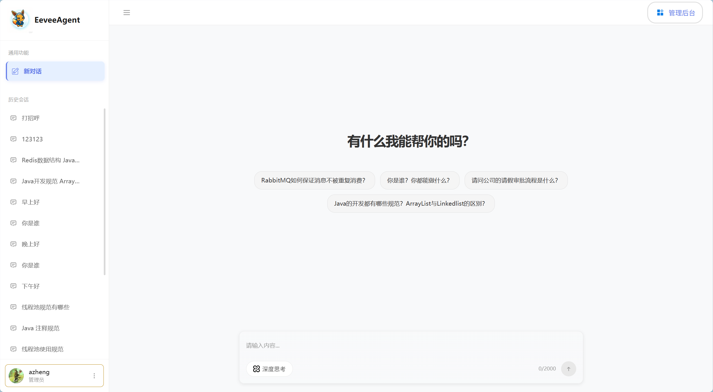

# EeveeAgent

## 项目介绍

EeveeAgent是一个从0到1开发的智能Agent系统，集成了知识库管理、RAG（检索增强生成）对话、意图识别等核心功能，旨在提供智能、高效的AI助手服务。

### 核心功能

- **知识库管理**：支持文档上传、自动分块、向量存储
- **智能对话**：基于RAG技术，结合知识库内容进行智能问答
- **意图识别**：自动识别用户意图，提供精准的响应
- **用户管理**：完整的用户认证、授权体系
- **前端界面**：现代化的Vue 3前端应用

## 技术栈

### 后端技术

| 技术 | 版本 | 用途 |
|------|------|------|
| Java | 17+ | 核心开发语言 |
| Spring Boot | 3.0+ | 应用框架 |
| MyBatis-Plus | 3.5+ | ORM框架 |
| MySQL | 8.0+ | 关系型数据库 |
| Redis | 7.0+ | 缓存 |
| Milvus | 2.6+ | 向量数据库 |
| LangChain4j | 0.24+ | AI应用框架 |
| Sa-Token | 1.30+ | 权限认证 |
| RustFS | - | 对象存储 |

### 前端技术

| 技术 | 版本 | 用途 |
|------|------|------|
| Vue | 3.5+ | 前端框架 |
| Vite | 8.0+ | 构建工具 |
| Pinia | 3.0+ | 状态管理 |
| Vue Router | 5.0+ | 路由管理 |
| Axios | 1.13+ | HTTP客户端 |
| Marked | 17.0+ | Markdown渲染 |
| Highlight.js | 11.11+ | 代码高亮 |

## 核心模块

### 1. 知识库管理

知识库模块负责文档的上传、处理、存储和管理，是RAG系统的基础。

- **文档上传**：支持多种格式文档的上传和验证
- **自动分块**：将文档自动分割为合适大小的文本块
- **向量存储**：将文本块转换为向量并存储到Milvus向量数据库
- **知识库管理**：支持知识库的创建、更新、删除等操作

### 2. RAG聊天

基于检索增强生成技术，结合知识库内容进行智能对话。

- **意图识别**：自动识别用户意图，提供精准的响应
- **相关文档检索**：根据用户问题从知识库中检索相关文档
- **答案生成**：结合检索结果和大语言模型生成准确的回答
- **对话管理**：支持多轮对话，维护对话上下文

### 3. 用户管理

完整的用户认证、授权体系，确保系统安全。

- **用户注册**：支持新用户注册
- **用户登录**：基于Sa-Token的认证机制
- **权限管理**：基于角色的权限控制
- **用户信息管理**：支持用户信息的更新和查询

### 4. 前端应用

现代化的Vue 3前端应用，提供直观、友好的用户界面。

- **响应式设计**：适配不同设备屏幕
- **组件化开发**：模块化的组件设计
- **路由管理**：基于Vue Router的路由系统
- **状态管理**：使用Pinia进行状态管理

## 技术架构

### 系统架构

EeveeAgent采用分层架构设计，确保系统的可扩展性和可维护性：

1. **表现层**：前端Vue应用和后端REST API
2. **业务逻辑层**：核心业务逻辑实现
3. **数据访问层**：数据库和向量数据库操作
4. **基础设施层**：框架、工具类和配置

### 数据流

1. **用户请求**：用户通过前端界面发起请求
2. **API处理**：后端API接收并处理请求
3. **业务逻辑**：调用相应的业务服务处理逻辑
4. **数据操作**：操作数据库或向量数据库
5. **响应返回**：将处理结果返回给前端

## 贡献指南

欢迎贡献代码和提出建议！

1. **Fork** 项目仓库
2. **创建** 功能分支
3. **提交** 代码修改
4. **推送** 到远程分支
5. **创建** Pull Request

## 许可证

本项目采用MIT许可证，详见LICENSE文件。

---

**EeveeAgent** - 智能Agent系统
